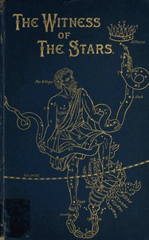

# The Witness of the Stars <kbd>v2.2.1</kbd>

## Authors

 - Bullinger, E. W. (Ethelbert William) <small>(1837 - 1913)</small>

## Translators

## Subjects

 - Astronomy
 - Astronomy in the Bible
 - Bible and science
 - Constellations

## Readablility

 - **A1:** 76%
 - **A2:** 81%
 - **B1:** 87%
 - **B2:** 93%
 - **C1:** 97%
 - **C2:** 100%

## Words Count

 - **A1:** 476
 - **A2:** 385
 - **B1:** 636
 - **B2:** 849
 - **C1:** 840
 - **C2:** 467

## Source

<kbd>GUTHENBURGE:49018</kbd>
