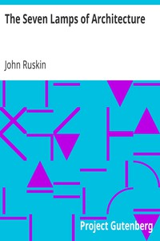

# The Seven Lamps of Architecture <kbd>v2.2.1</kbd>

## Authors

 - Ruskin, John <small>(1819 - 1900)</small>

## Translators

## Subjects

 - Architecture

## Readablility

 - **A1:** 73%
 - **A2:** 79%
 - **B1:** 86%
 - **B2:** 92%
 - **C1:** 98%
 - **C2:** 100%

## Words Count

 - **A1:** 485
 - **A2:** 440
 - **B1:** 778
 - **B2:** 1235
 - **C1:** 1509
 - **C2:** 949

## Source

<kbd>GUTHENBURGE:35898</kbd>
