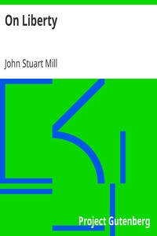

# On Liberty <kbd>v2.2.1</kbd>

## Authors

 - Mill, John Stuart <small>(1806 - 1873)</small>

## Translators

## Subjects

 - Liberty

## Readablility

 - **A1:** 73%
 - **A2:** 80%
 - **B1:** 86%
 - **B2:** 93%
 - **C1:** 98%
 - **C2:** 100%

## Words Count

 - **A1:** 464
 - **A2:** 381
 - **B1:** 645
 - **B2:** 1019
 - **C1:** 1152
 - **C2:** 729

## Source

<kbd>GUTHENBURGE:34901</kbd>
