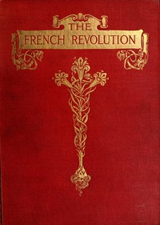

# The French Revolution: A History <kbd>v2.2.1</kbd>

## Authors

 - Carlyle, Thomas <small>(1795 - 1881)</small>

## Translators

## Subjects

 - France
 - France

## Readablility

 - **A1:** 73%
 - **A2:** 78%
 - **B1:** 84%
 - **B2:** 90%
 - **C1:** 96%
 - **C2:** 100%

## Words Count

 - **A1:** 493
 - **A2:** 495
 - **B1:** 966
 - **B2:** 1795
 - **C1:** 2964
 - **C2:** 3192

## Source

<kbd>GUTHENBURGE:1301</kbd>
