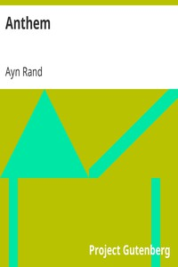

# Anthem <kbd>GUTHENBURGE</kbd>

## Authors

 - Rand, Ayn <small>(1905 - 1982)</small>

## Translators

## Subjects

 - Individuality
 - Love stories
 - Men
 - Psychological fiction
 - Science fiction
 - Time travel

## Readablility

 - **A1:** 58%
 - **A2:** 66%
 - **B1:** 77%
 - **B2:** 92%
 - **C1:** 95%
 - **C2:** 100%

## Words Count

 - **A1:** 422
 - **A2:** 286
 - **B1:** 435
 - **B2:** 546
 - **C1:** 200
 - **C2:** 548

## Tagger Version

v2.0.0
