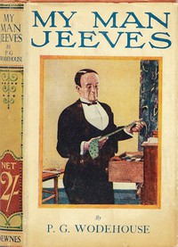

# My Man Jeeves <kbd>v2.2.1</kbd>

## Authors

 - Wodehouse, P. G. (Pelham Grenville) <small>(1881 - 1975)</small>

## Translators

## Subjects

 - England
 - Humorous stories
 - Jeeves (Fictitious character)
 - Single men
 - Valets
 - Wooster, Bertie (Fictitious character)

## Readablility

 - **A1:** 80%
 - **A2:** 85%
 - **B1:** 90%
 - **B2:** 95%
 - **C1:** 98%
 - **C2:** 100%

## Words Count

 - **A1:** 484
 - **A2:** 434
 - **B1:** 698
 - **B2:** 949
 - **C1:** 884
 - **C2:** 518

## Source

<kbd>GUTHENBURGE:8164</kbd>
