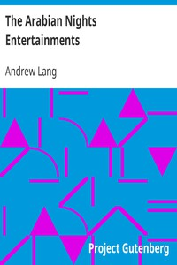

# The Arabian Nights Entertainments <kbd>v2.0.2</kbd>

## Authors

 - Lang, Andrew <small>(1844 - 1912)</small>

## Translators

## Subjects

 - Arabs
 - Children's stories
 - Fairy tales
 - Fairy tales
 - Folklore
 - Tales

## Readablility

 - **A1:** 57%
 - **A2:** 64%
 - **B1:** 74%
 - **B2:** 88%
 - **C1:** 91%
 - **C2:** 100%

## Words Count

 - **A1:** 562
 - **A2:** 519
 - **B1:** 897
 - **B2:** 1361
 - **C1:** 591
 - **C2:** 2803

## Source

<kbd>GUTHENBURGE:128</kbd>
