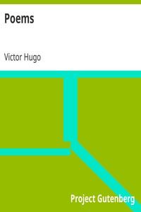

# Poems <kbd>v2.0.2</kbd>

## Authors

 - Hugo, Victor <small>(1802 - 1885)</small>

## Translators

## Subjects

 - French poetry
 - Hugo, Victor, 1802-1885

## Readablility

 - **A1:** 41%
 - **A2:** 47%
 - **B1:** 57%
 - **B2:** 72%
 - **C1:** 76%
 - **C2:** 100%

## Words Count

 - **A1:** 584
 - **A2:** 504
 - **B1:** 855
 - **B2:** 1429
 - **C1:** 688
 - **C2:** 6993

## Source

<kbd>GUTHENBURGE:8775</kbd>
