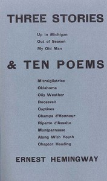

# Three Stories & Ten Poems <kbd>v2.3.0</kbd>

## Authors

 - Hemingway, Ernest <small>(1899 - 1961)</small>

## Translators

## Subjects

 - American fiction
 - American poetry
 - Short stories, American

## Readablility

 - **A1:** 76%
 - **A2:** 83%
 - **B1:** 89%
 - **B2:** 94%
 - **C1:** 98%
 - **C2:** 100%

## Words Count

 - **A1:** 416
 - **A2:** 255
 - **B1:** 328
 - **B2:** 364
 - **C1:** 291
 - **C2:** 130

## Source

<kbd>GUTHENBURGE:59603</kbd>
