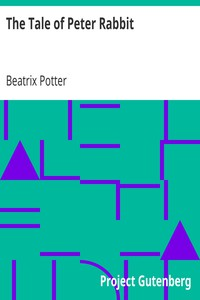

# The Tale of Peter Rabbit <kbd>v2.3.0</kbd>

## Authors

 - Potter, Beatrix <small>(1866 - 1943)</small>

## Translators

## Subjects

 - Rabbits

## Readablility

 - **A1:** 68%
 - **A2:** 76%
 - **B1:** 85%
 - **B2:** 93%
 - **C1:** 99%
 - **C2:** 100%

## Words Count

 - **A1:** 287
 - **A2:** 116
 - **B1:** 159
 - **B2:** 181
 - **C1:** 118
 - **C2:** 27

## Source

<kbd>GUTHENBURGE:14838</kbd>
