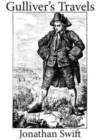

# Gulliver's Travels into Several Remote Nations of the World <kbd>v2.0.9</kbd>

## Authors

 - Swift, Jonathan <small>(1667 - 1745)</small>

## Translators

## Subjects

 - Fantasy fiction
 - Gulliver, Lemuel (Fictitious character)
 - Satire
 - Travelers
 - Voyages, Imaginary

## Readablility

 - **A1:** 70%
 - **A2:** 76%
 - **B1:** 83%
 - **B2:** 89%
 - **C1:** 90%
 - **C2:** 100%

## Words Count

 - **A1:** 823
 - **A2:** 642
 - **B1:** 1029
 - **B2:** 1344
 - **C1:** 495
 - **C2:** 4129

## Source

<kbd>GUTHENBURGE:829</kbd>
