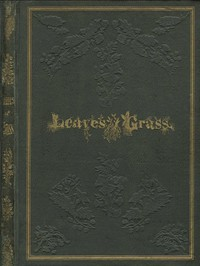

# Leaves of Grass <kbd>v2.2.1</kbd>

## Authors

 - Whitman, Walt <small>(1819 - 1892)</small>

## Translators

## Subjects

 - American poetry

## Readablility

 - **A1:** 73%
 - **A2:** 78%
 - **B1:** 84%
 - **B2:** 91%
 - **C1:** 96%
 - **C2:** 100%

## Words Count

 - **A1:** 482
 - **A2:** 454
 - **B1:** 824
 - **B2:** 1460
 - **C1:** 2061
 - **C2:** 2026

## Source

<kbd>GUTHENBURGE:1322</kbd>
