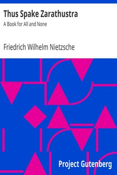

# Thus Spake Zarathustra: A Book for All and None <kbd>v2.0.9</kbd>

## Authors

 - Nietzsche, Friedrich Wilhelm <small>(1844 - 1900)</small>

## Translators

 - Common, Thomas <small>(1850 - 1919)</small>

## Subjects

 - Philosophy, German
 - Superman (Philosophical concept)

## Readablility

 - **A1:** 66%
 - **A2:** 71%
 - **B1:** 77%
 - **B2:** 83%
 - **C1:** 85%
 - **C2:** 100%

## Words Count

 - **A1:** 811
 - **A2:** 608
 - **B1:** 946
 - **B2:** 1313
 - **C1:** 481
 - **C2:** 5531

## Source

<kbd>GUTHENBURGE:1998</kbd>
