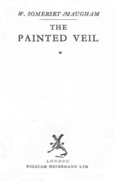

# The Painted Veil <kbd>v2.2.1</kbd>

## Authors

 - Maugham, W. Somerset (William Somerset) <small>(1874 - 1965)</small>

## Translators

## Subjects

 - Adultery
 - Bacteriologists
 - British
 - China
 - Cholera
 - Domestic fiction
 - Married people
 - Psychological fiction

## Readablility

 - **A1:** 80%
 - **A2:** 86%
 - **B1:** 91%
 - **B2:** 95%
 - **C1:** 98%
 - **C2:** 100%

## Words Count

 - **A1:** 490
 - **A2:** 462
 - **B1:** 807
 - **B2:** 1149
 - **C1:** 1181
 - **C2:** 681

## Source

<kbd>GUTHENBURGE:64682</kbd>
