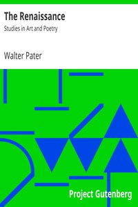

# The Renaissance: Studies in Art and Poetry <kbd>v2.2.1</kbd>

## Authors

 - Pater, Walter <small>(1839 - 1894)</small>

## Translators

## Subjects

 - Arts, Renaissance
 - Renaissance
 - Renaissance

## Readablility

 - **A1:** 74%
 - **A2:** 80%
 - **B1:** 86%
 - **B2:** 92%
 - **C1:** 97%
 - **C2:** 100%

## Words Count

 - **A1:** 488
 - **A2:** 447
 - **B1:** 764
 - **B2:** 1154
 - **C1:** 1354
 - **C2:** 852

## Source

<kbd>GUTHENBURGE:2398</kbd>
