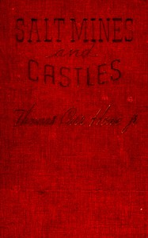

# Salt mines and castles: The discovery and restitution of looted European art <kbd>v2.3.0</kbd>

## Authors

 - Howe, Thomas Carr <small>(1904 - 1994)</small>

## Translators

## Subjects

 - Art
 - World War, 1939-1945
 - World War, 1939-1945

## Readablility

 - **A1:** 75%
 - **A2:** 80%
 - **B1:** 86%
 - **B2:** 92%
 - **C1:** 97%
 - **C2:** 100%

## Words Count

 - **A1:** 484
 - **A2:** 470
 - **B1:** 836
 - **B2:** 1284
 - **C1:** 1540
 - **C2:** 1167

## Source

<kbd>GUTHENBURGE:68150</kbd>
