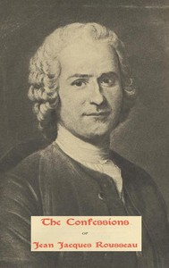

# The Confessions of Jean Jacques Rousseau — Complete <kbd>v2.0.2</kbd>

## Authors

 - Rousseau, Jean-Jacques <small>(1712 - 1778)</small>

## Translators

## Subjects

 - Authors, French
 - Rousseau, Jean-Jacques, 1712-1778

## Readablility

 - **A1:** 55%
 - **A2:** 62%
 - **B1:** 72%
 - **B2:** 85%
 - **C1:** 88%
 - **C2:** 100%

## Words Count

 - **A1:** 619
 - **A2:** 631
 - **B1:** 1110
 - **B2:** 1868
 - **C1:** 773
 - **C2:** 7514

## Source

<kbd>GUTHENBURGE:3913</kbd>
