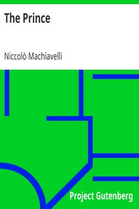

# The Prince <kbd>v2.3.0</kbd>

## Authors

 - Machiavelli, Niccolò <small>(1469 - 1527)</small>

## Translators

 - Marriott, W. K. (William Kenaz) <small>(-1 - 1927)</small>

## Subjects

 - Political ethics
 - Political science
 - State, The

## Readablility

 - **A1:** 78%
 - **A2:** 84%
 - **B1:** 90%
 - **B2:** 95%
 - **C1:** 99%
 - **C2:** 100%

## Words Count

 - **A1:** 479
 - **A2:** 419
 - **B1:** 673
 - **B2:** 930
 - **C1:** 925
 - **C2:** 445

## Source

<kbd>GUTHENBURGE:1232</kbd>
