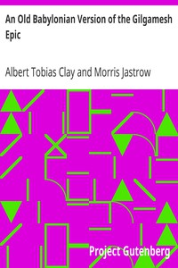

# An Old Babylonian Version of the Gilgamesh Epic <kbd>v2.3.0</kbd>

## Authors

 - Clay, Albert Tobias <small>(1866 - 1925)</small>
 - Jastrow, Morris <small>(1861 - 1921)</small>

## Translators

## Subjects

 - Epic poetry, Assyro-Babylonian

## Readablility

 - **A1:** 73%
 - **A2:** 78%
 - **B1:** 83%
 - **B2:** 89%
 - **C1:** 95%
 - **C2:** 99%

## Words Count

 - **A1:** 451
 - **A2:** 334
 - **B1:** 518
 - **B2:** 703
 - **C1:** 598
 - **C2:** 388

## Source

<kbd>GUTHENBURGE:11000</kbd>
