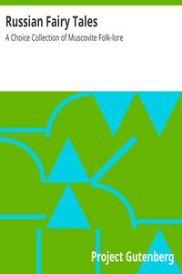

# Russian Fairy Tales: A Choice Collection of Muscovite Folk-lore <kbd>v2.3.0</kbd>

## Authors

## Translators

 - Ralston, William Ralston Shedden <small>(1828 - 1889)</small>

## Subjects

 - Folklore

## Readablility

 - **A1:** 77%
 - **A2:** 82%
 - **B1:** 88%
 - **B2:** 93%
 - **C1:** 98%
 - **C2:** 100%

## Words Count

 - **A1:** 493
 - **A2:** 475
 - **B1:** 886
 - **B2:** 1390
 - **C1:** 1654
 - **C2:** 1102

## Source

<kbd>GUTHENBURGE:22373</kbd>
