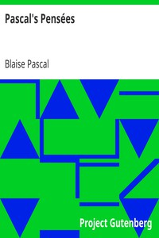

# Pascal's Pensées <kbd>v2.0.2</kbd>

## Authors

 - Pascal, Blaise <small>(1623 - 1662)</small>

## Translators

## Subjects

 - Apologetics
 - Philosophy

## Readablility

 - **A1:** 51%
 - **A2:** 59%
 - **B1:** 70%
 - **B2:** 84%
 - **C1:** 86%
 - **C2:** 100%

## Words Count

 - **A1:** 586
 - **A2:** 534
 - **B1:** 826
 - **B2:** 1309
 - **C1:** 526
 - **C2:** 4396

## Source

<kbd>GUTHENBURGE:18269</kbd>
