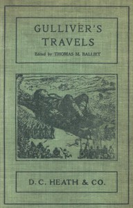

# Gulliver's Travels into Several Remote Regions of the World <kbd>v2.2.1</kbd>

## Authors

 - Swift, Jonathan <small>(1667 - 1745)</small>

## Translators

## Subjects

 - Fantasy fiction
 - Gulliver, Lemuel (Fictitious character)
 - Satire
 - Travelers
 - Voyages, Imaginary

## Readablility

 - **A1:** 75%
 - **A2:** 81%
 - **B1:** 88%
 - **B2:** 94%
 - **C1:** 98%
 - **C2:** 100%

## Words Count

 - **A1:** 485
 - **A2:** 454
 - **B1:** 772
 - **B2:** 1129
 - **C1:** 1139
 - **C2:** 561

## Source

<kbd>GUTHENBURGE:17157</kbd>
