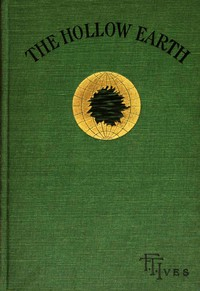

# The Hollow Earth <kbd>v2.2.1</kbd>

## Authors

 - Ives, F. T. (Franklin Titus) <small>(1828 - 1910)</small>

## Translators

## Subjects

 - Earth (Planet)

## Readablility

 - **A1:** 70%
 - **A2:** 76%
 - **B1:** 84%
 - **B2:** 92%
 - **C1:** 97%
 - **C2:** 100%

## Words Count

 - **A1:** 455
 - **A2:** 378
 - **B1:** 579
 - **B2:** 815
 - **C1:** 854
 - **C2:** 498

## Source

<kbd>GUTHENBURGE:68122</kbd>
