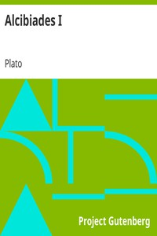

# Alcibiades I <kbd>v2.2.1</kbd>

## Authors

 - Plato (spurious and doubtful works) <small>(-428 - -348)</small>

## Translators

## Subjects

 - Alcibiades
 - Classical literature
 - Socrates, 470 BC-399 BC
 - Virtue

## Readablility

 - **A1:** 80%
 - **A2:** 85%
 - **B1:** 91%
 - **B2:** 95%
 - **C1:** 99%
 - **C2:** 100%

## Words Count

 - **A1:** 419
 - **A2:** 296
 - **B1:** 394
 - **B2:** 482
 - **C1:** 375
 - **C2:** 174

## Source

<kbd>GUTHENBURGE:1676</kbd>
