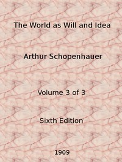

# The World as Will and Idea (Vol. 3 of 3) <kbd>v2.2.1</kbd>

## Authors

 - Schopenhauer, Arthur <small>(1788 - 1860)</small>

## Translators

 - Haldane, R. B. Haldane (Richard Burdon Haldane), Viscount <small>(1856 - 1928)</small>
 - Kemp, J. (John) <small>(-1 - -1)</small>

## Subjects

 - Idea (Philosophy)
 - Knowledge, Theory of
 - Philosophy
 - Will

## Readablility

 - **A1:** 75%
 - **A2:** 80%
 - **B1:** 86%
 - **B2:** 93%
 - **C1:** 97%
 - **C2:** 100%

## Words Count

 - **A1:** 490
 - **A2:** 464
 - **B1:** 858
 - **B2:** 1405
 - **C1:** 1797
 - **C2:** 1470

## Source

<kbd>GUTHENBURGE:40868</kbd>
