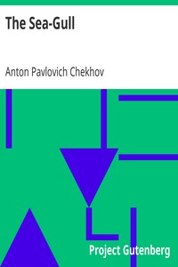

# The Sea-Gull <kbd>v2.2.1</kbd>

## Authors

 - Chekhov, Anton Pavlovich <small>(1860 - 1904)</small>

## Translators

## Subjects

 - Authors, Russian
 - Man-woman relationships
 - Russia
 - Russian drama

## Readablility

 - **A1:** 76%
 - **A2:** 83%
 - **B1:** 89%
 - **B2:** 94%
 - **C1:** 99%
 - **C2:** 100%

## Words Count

 - **A1:** 468
 - **A2:** 362
 - **B1:** 512
 - **B2:** 575
 - **C1:** 513
 - **C2:** 202

## Source

<kbd>GUTHENBURGE:1754</kbd>
