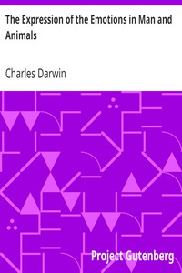

# The Expression of the Emotions in Man and Animals <kbd>v2.3.0</kbd>

## Authors

 - Darwin, Charles <small>(1809 - 1882)</small>

## Translators

## Subjects

 - Emotions
 - Expression
 - Instinct
 - Psychology, Comparative

## Readablility

 - **A1:** 71%
 - **A2:** 77%
 - **B1:** 85%
 - **B2:** 91%
 - **C1:** 97%
 - **C2:** 100%

## Words Count

 - **A1:** 487
 - **A2:** 451
 - **B1:** 756
 - **B2:** 1145
 - **C1:** 1324
 - **C2:** 949

## Source

<kbd>GUTHENBURGE:1227</kbd>
