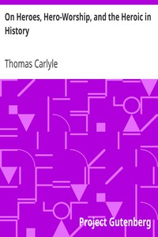

# On Heroes, Hero-Worship, and the Heroic in History <kbd>v2.0.2</kbd>

## Authors

 - Carlyle, Thomas <small>(1795 - 1881)</small>

## Translators

## Subjects

 - Hero worship
 - Heroes

## Readablility

 - **A1:** 50%
 - **A2:** 57%
 - **B1:** 68%
 - **B2:** 83%
 - **C1:** 87%
 - **C2:** 100%

## Words Count

 - **A1:** 588
 - **A2:** 569
 - **B1:** 895
 - **B2:** 1448
 - **C1:** 603
 - **C2:** 4684

## Source

<kbd>GUTHENBURGE:1091</kbd>
