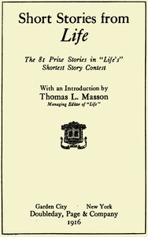

# Short stories from Life: The 81 prize stories in "Life's" Shortest Story Contest <kbd>v2.0.2</kbd>

## Authors

## Translators

## Subjects

 - American fiction
 - Short stories, American

## Readablility

 - **A1:** 51%
 - **A2:** 58%
 - **B1:** 69%
 - **B2:** 82%
 - **C1:** 86%
 - **C2:** 100%

## Words Count

 - **A1:** 598
 - **A2:** 558
 - **B1:** 964
 - **B2:** 1507
 - **C1:** 695
 - **C2:** 4643

## Source

<kbd>GUTHENBURGE:68085</kbd>
