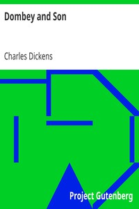

# Dombey and Son <kbd>v2.3.0</kbd>

## Authors

 - Dickens, Charles <small>(1812 - 1870)</small>

## Translators

## Subjects

 - Businesspeople
 - Domestic fiction
 - Dysfunctional families
 - England
 - Family-owned business enterprises
 - Fathers and daughters

## Readablility

 - **A1:** 78%
 - **A2:** 83%
 - **B1:** 89%
 - **B2:** 94%
 - **C1:** 98%
 - **C2:** 100%

## Words Count

 - **A1:** 494
 - **A2:** 495
 - **B1:** 963
 - **B2:** 1843
 - **C1:** 2980
 - **C2:** 2725

## Source

<kbd>GUTHENBURGE:821</kbd>
