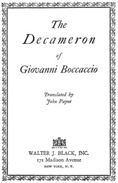

# The Decameron of Giovanni Boccaccio <kbd>v2.0.2</kbd>

## Authors

 - Boccaccio, Giovanni <small>(1313 - 1375)</small>

## Translators

 - Payne, John <small>(1842 - 1916)</small>

## Subjects

 - Allegories
 - Frame-stories
 - Plague
 - Storytelling

## Readablility

 - **A1:** 53%
 - **A2:** 60%
 - **B1:** 69%
 - **B2:** 81%
 - **C1:** 84%
 - **C2:** 100%

## Words Count

 - **A1:** 591
 - **A2:** 548
 - **B1:** 971
 - **B2:** 1593
 - **C1:** 699
 - **C2:** 8830

## Source

<kbd>GUTHENBURGE:23700</kbd>
