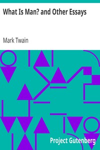

# What Is Man? and Other Essays <kbd>v2.3.0</kbd>

## Authors

 - Twain, Mark <small>(1835 - 1910)</small>

## Translators

## Subjects

 - American essays

## Readablility

 - **A1:** 76%
 - **A2:** 82%
 - **B1:** 88%
 - **B2:** 93%
 - **C1:** 98%
 - **C2:** 100%

## Words Count

 - **A1:** 494
 - **A2:** 488
 - **B1:** 925
 - **B2:** 1546
 - **C1:** 1848
 - **C2:** 1329

## Source

<kbd>GUTHENBURGE:70</kbd>
