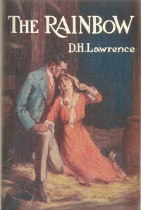

# The Rainbow <kbd>v2.3.0</kbd>

## Authors

 - Lawrence, D. H. (David Herbert) <small>(1885 - 1930)</small>

## Translators

## Subjects

 - Domestic fiction
 - Family
 - Midlands (England)

## Readablility

 - **A1:** 77%
 - **A2:** 83%
 - **B1:** 89%
 - **B2:** 94%
 - **C1:** 98%
 - **C2:** 100%

## Words Count

 - **A1:** 495
 - **A2:** 484
 - **B1:** 922
 - **B2:** 1542
 - **C1:** 2074
 - **C2:** 1818

## Source

<kbd>GUTHENBURGE:28948</kbd>
