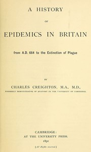

# A History of Epidemics in Britain, Volume 1 (of 2): From A.D. 664 to the Extinction of Plague <kbd>v2.3.0</kbd>

## Authors

 - Creighton, Charles <small>(1847 - 1927)</small>

## Translators

## Subjects

 - Epidemics

## Readablility

 - **A1:** 75%
 - **A2:** 81%
 - **B1:** 86%
 - **B2:** 91%
 - **C1:** 96%
 - **C2:** 100%

## Words Count

 - **A1:** 492
 - **A2:** 488
 - **B1:** 932
 - **B2:** 1630
 - **C1:** 2329
 - **C2:** 2097

## Source

<kbd>GUTHENBURGE:42686</kbd>
