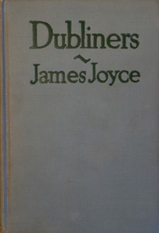

# Dubliners <kbd>v2.2.1</kbd>

## Authors

 - Joyce, James <small>(1882 - 1941)</small>

## Translators

## Subjects

 - Dublin (Ireland)
 - Short stories

## Readablility

 - **A1:** 78%
 - **A2:** 84%
 - **B1:** 89%
 - **B2:** 94%
 - **C1:** 98%
 - **C2:** 100%

## Words Count

 - **A1:** 488
 - **A2:** 470
 - **B1:** 812
 - **B2:** 1212
 - **C1:** 1401
 - **C2:** 902

## Source

<kbd>GUTHENBURGE:2814</kbd>
