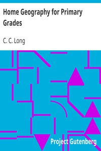

# Home Geography for Primary Grades <kbd>v2.3.0</kbd>

## Authors

 - Long, C. C. <small>(-1 - -1)</small>

## Translators

## Subjects

 - Geography

## Readablility

 - **A1:** 71%
 - **A2:** 79%
 - **B1:** 87%
 - **B2:** 94%
 - **C1:** 98%
 - **C2:** 100%

## Words Count

 - **A1:** 432
 - **A2:** 300
 - **B1:** 422
 - **B2:** 484
 - **C1:** 437
 - **C2:** 198

## Source

<kbd>GUTHENBURGE:12228</kbd>
