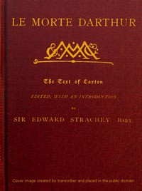

# Le Morte Darthur: Sir Thomas Malory's Book of King Arthur and his Noble; Knights of the Round Table <kbd>v2.2.1</kbd>

## Authors

 - Malory, Thomas, Sir <small>(-1 - 1471)</small>

## Translators

## Subjects

 - Arthurian romances

## Readablility

 - **A1:** 79%
 - **A2:** 83%
 - **B1:** 88%
 - **B2:** 92%
 - **C1:** 99%
 - **C2:** 100%

## Words Count

 - **A1:** 491
 - **A2:** 469
 - **B1:** 842
 - **B2:** 1260
 - **C1:** 1443
 - **C2:** 940

## Source

<kbd>GUTHENBURGE:46853</kbd>
