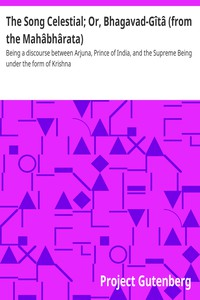

# The Song Celestial; Or, Bhagavad-Gîtâ (from the Mahâbhârata): Being a discourse between Arjuna, Prince of India, and the Supreme Being under the form of Krishna <kbd>v2.3.0</kbd>

## Authors

## Translators

 - Arnold, Edwin, Sir <small>(1832 - 1904)</small>

## Subjects

 - Epic poetry
 - Hinduism
 - Sanskrit poetry

## Readablility

 - **A1:** 71%
 - **A2:** 78%
 - **B1:** 85%
 - **B2:** 92%
 - **C1:** 97%
 - **C2:** 100%

## Words Count

 - **A1:** 434
 - **A2:** 304
 - **B1:** 487
 - **B2:** 650
 - **C1:** 613
 - **C2:** 356

## Source

<kbd>GUTHENBURGE:2388</kbd>
