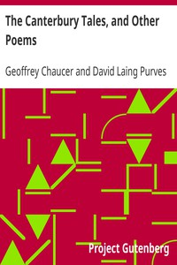

# The Canterbury Tales, and Other Poems <kbd>v2.3.0</kbd>

## Authors

 - Chaucer, Geoffrey <small>(1342 - 1400)</small>

## Translators

## Subjects

 - Chaucer, Geoffrey, -1400
 - Christian pilgrims and pilgrimages
 - English poetry

## Readablility

 - **A1:** 78%
 - **A2:** 83%
 - **B1:** 88%
 - **B2:** 93%
 - **C1:** 97%
 - **C2:** 100%

## Words Count

 - **A1:** 493
 - **A2:** 492
 - **B1:** 933
 - **B2:** 1618
 - **C1:** 2311
 - **C2:** 2097

## Source

<kbd>GUTHENBURGE:2383</kbd>
