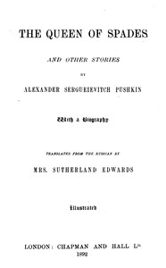

# The Queen of Spades, and other stories <kbd>v2.3.0</kbd>

## Authors

 - Pushkin, Aleksandr Sergeevich <small>(1799 - 1837)</small>

## Translators

 - Edwards, H. Sutherland, Mrs. <small>(-1 - -1)</small>

## Subjects

 - Pushkin, Aleksandr Sergeevich, 1799-1837
 - Russia
 - Russian fiction
 - Short stories, Russian

## Readablility

 - **A1:** 74%
 - **A2:** 81%
 - **B1:** 87%
 - **B2:** 93%
 - **C1:** 98%
 - **C2:** 100%

## Words Count

 - **A1:** 491
 - **A2:** 481
 - **B1:** 856
 - **B2:** 1287
 - **C1:** 1359
 - **C2:** 692

## Source

<kbd>GUTHENBURGE:55024</kbd>
