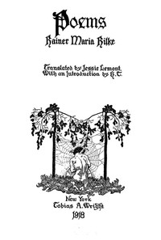

# Poems <kbd>v2.2.1</kbd>

## Authors

 - Rilke, Rainer Maria <small>(1875 - 1926)</small>

## Translators

 - Lemont, Jessie <small>(-1 - -1)</small>

## Subjects

 - Poetry

## Readablility

 - **A1:** 70%
 - **A2:** 77%
 - **B1:** 84%
 - **B2:** 92%
 - **C1:** 97%
 - **C2:** 100%

## Words Count

 - **A1:** 419
 - **A2:** 270
 - **B1:** 388
 - **B2:** 523
 - **C1:** 467
 - **C2:** 239

## Source

<kbd>GUTHENBURGE:38594</kbd>
