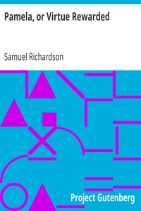

# Pamela, or Virtue Rewarded <kbd>v2.3.0</kbd>

## Authors

 - Richardson, Samuel <small>(1689 - 1761)</small>

## Translators

## Subjects

 - Didactic fiction
 - England
 - Epistolary fiction
 - Kidnapping victims
 - Master and servant
 - Virtue
 - Women household employees

## Readablility

 - **A1:** 82%
 - **A2:** 87%
 - **B1:** 92%
 - **B2:** 96%
 - **C1:** 99%
 - **C2:** 100%

## Words Count

 - **A1:** 493
 - **A2:** 460
 - **B1:** 831
 - **B2:** 1328
 - **C1:** 1631
 - **C2:** 991

## Source

<kbd>GUTHENBURGE:6124</kbd>
