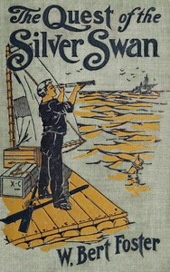

# The quest of the Silver Swan: A land and sea tale for boys <kbd>v2.2.1</kbd>

## Authors

 - Foster, W. Bert (Walter Bertram) <small>(1869 - 1929)</small>

## Translators

## Subjects

## Readablility

 - **A1:** 75%
 - **A2:** 81%
 - **B1:** 87%
 - **B2:** 92%
 - **C1:** 98%
 - **C2:** 100%

## Words Count

 - **A1:** 491
 - **A2:** 454
 - **B1:** 771
 - **B2:** 1074
 - **C1:** 1131
 - **C2:** 681

## Source

<kbd>GUTHENBURGE:68182</kbd>
