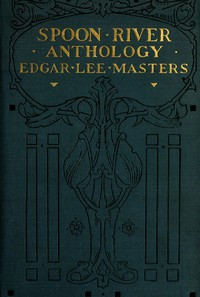

# Spoon River Anthology <kbd>v2.3.0</kbd>

## Authors

 - Masters, Edgar Lee <small>(1868 - 1950)</small>

## Translators

## Subjects

 - American poetry

## Readablility

 - **A1:** 74%
 - **A2:** 81%
 - **B1:** 86%
 - **B2:** 92%
 - **C1:** 97%
 - **C2:** 100%

## Words Count

 - **A1:** 478
 - **A2:** 406
 - **B1:** 649
 - **B2:** 937
 - **C1:** 1020
 - **C2:** 682

## Source

<kbd>GUTHENBURGE:1280</kbd>
