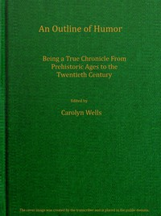

# An outline of humor: Being a true chronicle from prehistoric ages to the twentieth century <kbd>v2.3.0</kbd>

## Authors

## Translators

## Subjects

 - Wit and humor

## Readablility

 - **A1:** 75%
 - **A2:** 81%
 - **B1:** 86%
 - **B2:** 92%
 - **C1:** 97%
 - **C2:** 100%

## Words Count

 - **A1:** 495
 - **A2:** 498
 - **B1:** 991
 - **B2:** 1876
 - **C1:** 3058
 - **C2:** 3030

## Source

<kbd>GUTHENBURGE:68163</kbd>
