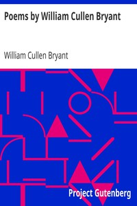

# Poems by William Cullen Bryant <kbd>v2.2.1</kbd>

## Authors

 - Bryant, William Cullen <small>(1794 - 1878)</small>

## Translators

## Subjects

 - American poetry

## Readablility

 - **A1:** 68%
 - **A2:** 76%
 - **B1:** 83%
 - **B2:** 90%
 - **C1:** 97%
 - **C2:** 100%

## Words Count

 - **A1:** 468
 - **A2:** 383
 - **B1:** 655
 - **B2:** 1008
 - **C1:** 1199
 - **C2:** 874

## Source

<kbd>GUTHENBURGE:16341</kbd>
