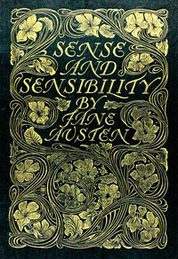

# Sense and Sensibility <kbd>GUTHENBURGE</kbd>

## Authors

 - Austen, Jane <small>(1775 - 1817)</small>

## Translators

## Subjects

 - Domestic fiction
 - England
 - England
 - Gentry
 - Inheritance and succession
 - Love stories
 - Mate selection
 - Regency fiction
 - Sisters
 - Social classes
 - Young women

## Readablility

 - **A1:** 52%
 - **A2:** 66%
 - **B1:** 79%
 - **B2:** 90%
 - **C1:** 98%
 - **C2:** 100%

## Words Count

 - **A1:** 398
 - **A2:** 456
 - **B1:** 790
 - **B2:** 1185
 - **C1:** 1371
 - **C2:** 747
