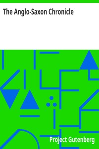

# The Anglo-Saxon Chronicle <kbd>v2.3.0</kbd>

## Authors

## Translators

 - Giles, J. A. (John Allen) <small>(1808 - 1884)</small>
 - Ingram, J. (James) <small>(1774 - 1850)</small>

## Subjects

 - Anglo-Saxons
 - Great Britain

## Readablility

 - **A1:** 80%
 - **A2:** 85%
 - **B1:** 89%
 - **B2:** 94%
 - **C1:** 98%
 - **C2:** 100%

## Words Count

 - **A1:** 478
 - **A2:** 389
 - **B1:** 666
 - **B2:** 936
 - **C1:** 1001
 - **C2:** 603

## Source

<kbd>GUTHENBURGE:657</kbd>
