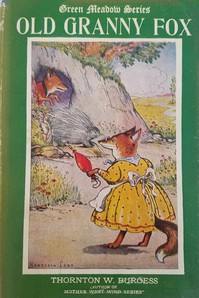

# Old Granny Fox <kbd>v2.0.9</kbd>

## Authors

 - Burgess, Thornton W. (Thornton Waldo) <small>(1874 - 1965)</small>

## Translators

## Subjects

 - Animals
 - Foxes

## Readablility

 - **A1:** 71%
 - **A2:** 75%
 - **B1:** 81%
 - **B2:** 86%
 - **C1:** 87%
 - **C2:** 100%

## Words Count

 - **A1:** 610
 - **A2:** 314
 - **B1:** 421
 - **B2:** 351
 - **C1:** 110
 - **C2:** 699

## Source

<kbd>GUTHENBURGE:4980</kbd>
