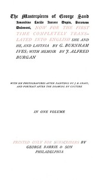

# She and he; Lavinia; Memoir <kbd>v2.2.1</kbd>

## Authors

 - Sand, George <small>(1804 - 1876)</small>

## Translators

 - Ives, George Burnham <small>(1856 - 1930)</small>

## Subjects

 - French fiction
 - Sand, George, 1804-1876

## Readablility

 - **A1:** 76%
 - **A2:** 81%
 - **B1:** 87%
 - **B2:** 93%
 - **C1:** 97%
 - **C2:** 100%

## Words Count

 - **A1:** 488
 - **A2:** 484
 - **B1:** 910
 - **B2:** 1495
 - **C1:** 1832
 - **C2:** 1177

## Source

<kbd>GUTHENBURGE:68045</kbd>
